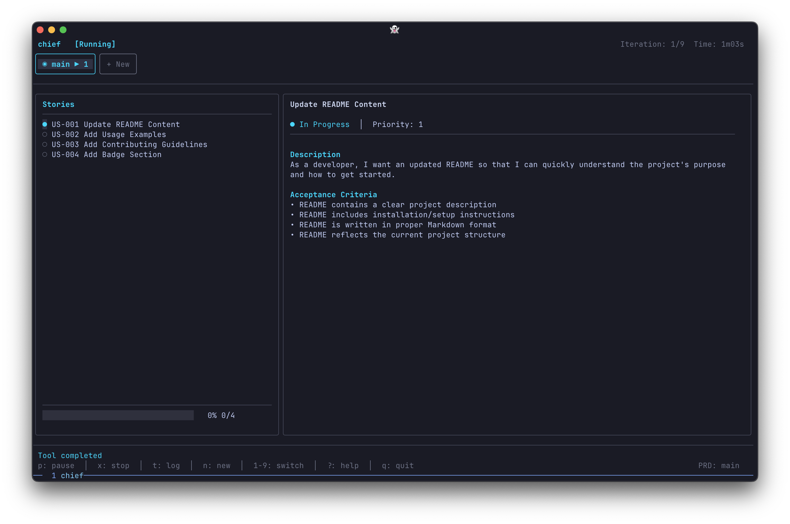

# Melliza

Melliza is an autonomous agent loop that orchestrates the **Gemini CLI** to work through user stories in a **Product Requirements Document (PRD)**.

Built on the "Ralph Wiggum loop" pattern, Melliza breaks down complex project requirements into manageable tasks, invokes Gemini to implement them one by one, and maintains persistent progress tracking.



## Core Features

- **Autonomous Loop**: Orchestrates Gemini CLI to work through user stories without manual intervention.
- **PRD-Driven Development**: Work directly from human-readable `prd.md` files.
- **Persistent Progress**: Progress is tracked in `prd.json` and `progress.md`, ensuring work can be resumed across sessions.
- **TUI Dashboard**: A real-time terminal user interface to monitor Gemini's progress, logs, and diffs.
- **Smart Worktrees**: Automatically creates git branches or worktrees for each PRD to keep your main workspace clean.
- **Auto-Commit & Test**: Gemini implements the story, runs your project's tests, and commits changes automatically.

## Quick Start

### 1. Install Melliza

```bash
# Via Homebrew
brew install lvcoi/melliza/melliza

# Or via install script
curl -fsSL https://raw.githubusercontent.com/lvcoi/melliza/main/install.sh | bash
```

### 2. Install Gemini CLI

Ensure you have the [Gemini CLI](https://github.com/google/gemini-cli) installed and authenticated.

### 3. Create a new PRD

```bash
melliza new my-project
```

This will launch an interactive session to collaborate on a `prd.md` file.

### 4. Run the Loop

```bash
melliza my-project
```

Melliza will now start implementing the stories in your PRD one by one.

## How it Works

Melliza follows a simple, repeatable cycle:

1. **Plan**: Identify the next incomplete story in `prd.json`.
2. **Execute**: Invoke Gemini CLI with a specialized system prompt and the current story context.
3. **Monitor**: Parse Gemini's `stream-json` output to update the TUI and progress files.
4. **Finalize**: Once Gemini completes the story, Melliza moves to the next one.

## Documentation

Full documentation is available at [melliza.dev](https://melliza.dev).

- [Installation Guide](https://melliza.dev/guide/installation)
- [Quick Start](https://melliza.dev/guide/quick-start)
- [How it Works](https://melliza.dev/concepts/how-it-works)
- [PRD Format](https://melliza.dev/concepts/prd-format)

## Development

Melliza is written in Go.

```bash
# Build
make build

# Test
make test

# Run
make run
```

## License

MIT
